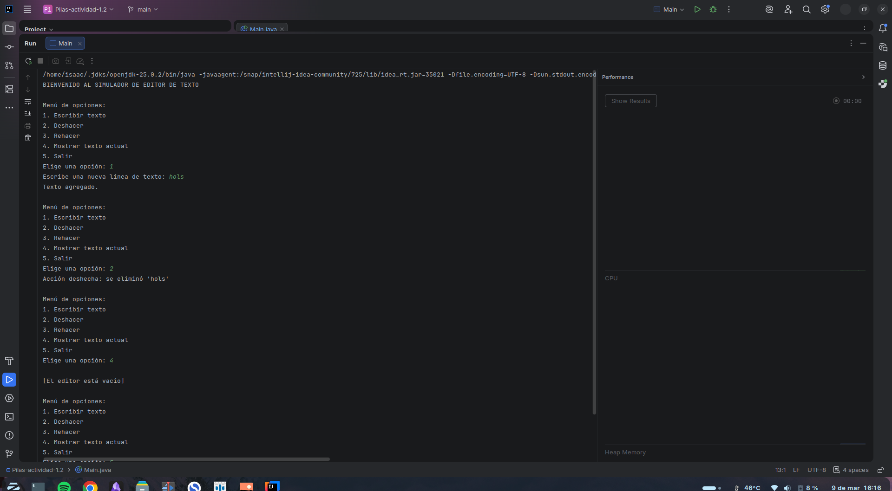

# Actividad - Pilas (Stack): Simulador de Editor de Texto

## Objetivo del proyecto
El objetivo de este proyecto es comprender y aplicar la estructura de datos tipo Pila (Stack) basándose en el principio LIFO (Last In, First Out). Se implementó un simulador de editor de texto en consola mediante Java, construyendo una Pila de forma manual (sin el uso de `java.util.Stack`) para gestionar un sistema funcional de "Deshacer" (Undo) y "Rehacer" (Redo) utilizando dos pilas independientes.

## Instrucciones de ejecución
1. Clona este repositorio o descarga el archivo `EditorTexto.java`.
2. Abre una terminal y navega hasta la carpeta donde se encuentra el archivo.
3. Compila el código fuente con el comando:
   `javac EditorTexto.java`
4. Ejecuta el programa con el comando:
   `java EditorTexto`
5. Utiliza el menú numérico (1-5) mostrado en consola para escribir líneas de texto, deshacer, rehacer y visualizar el texto actual.

## Capturas de pantalla de la ejecución
*Instrucciones: Ejecuta el programa, escribe un par de líneas, usa las opciones de deshacer/rehacer/mostrar, toma una captura de consola y reemplaza este texto por tu imagen).*

## Contribuyentes
Isaac Daniel Torrenegra Cantillo
